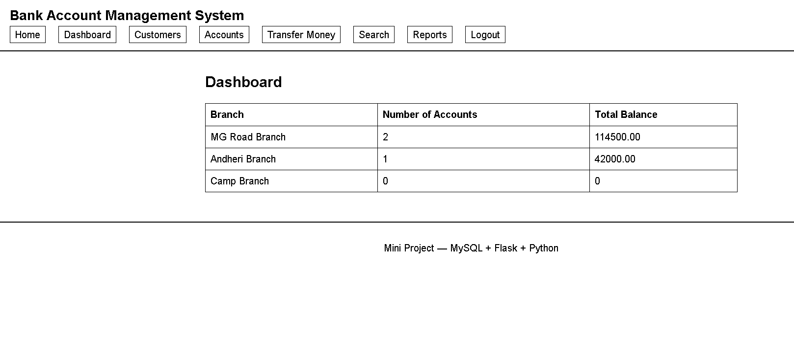
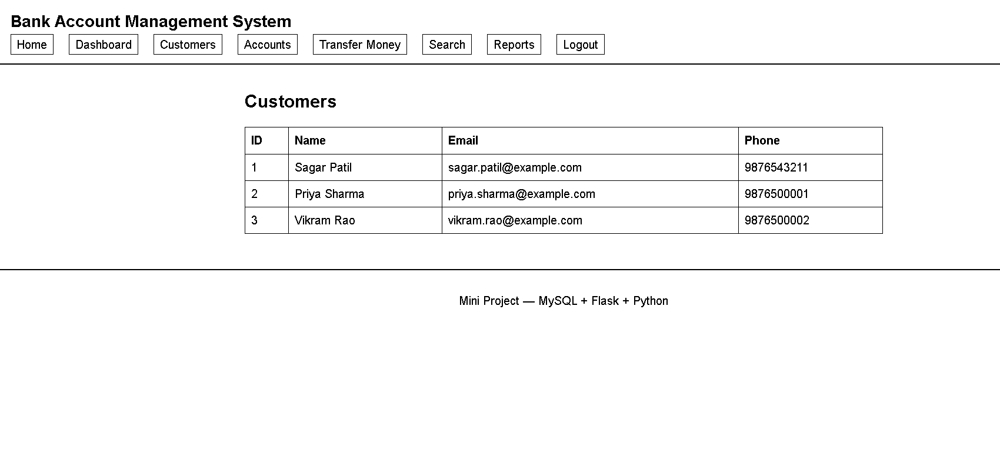
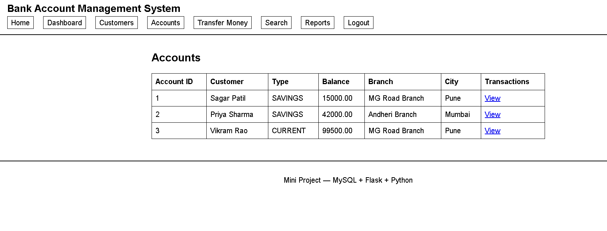
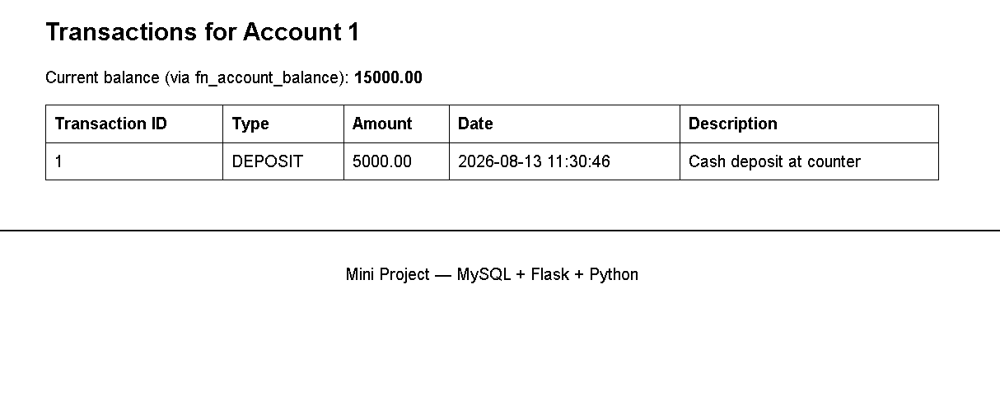
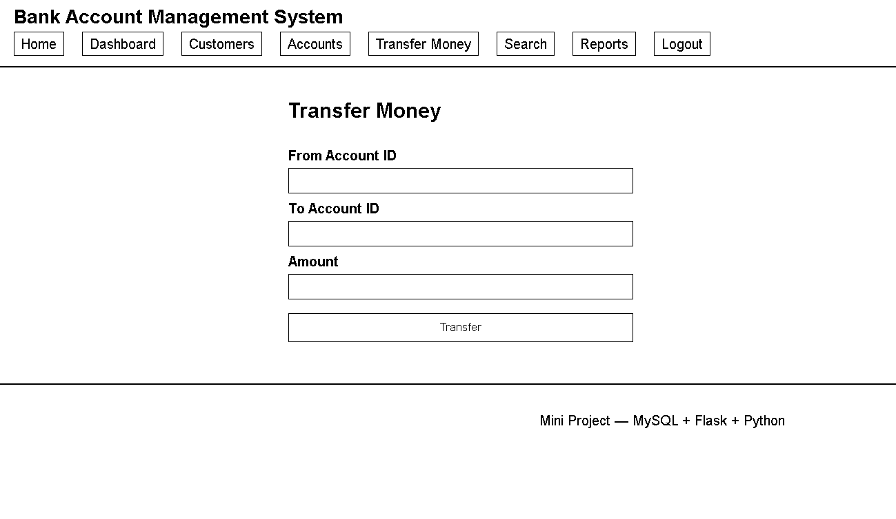
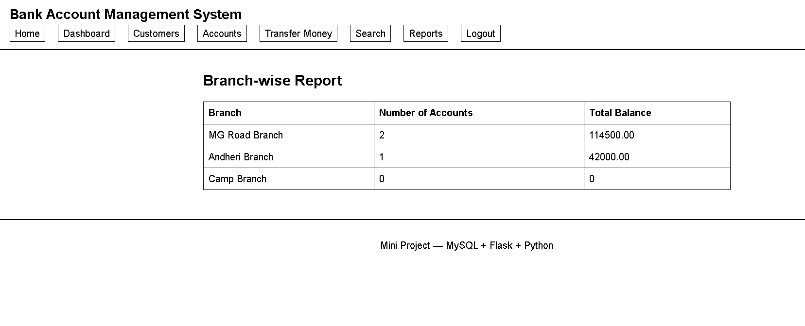

# Bank Account Management System Using MySQL and Flask

A small full-stack **Flask + MySQL** web application built as a DBMS mini project.
It demonstrates a complete slice of database-backed web development — schema
design, constraints, stored procedures, triggers, transactions, and a Flask
front end on top of it — using a bank account management theme.

> Built for academic purposes (DBMS coursework). Not a production banking
> system — see [Limitations](#limitations) below for an honest breakdown of
> what is and isn't implemented.

---

## Overview

The app lets a logged-in user browse branches, customers, and accounts, view
transaction history, search for customers, and transfer money between two
existing accounts. Most of the interesting logic — balance updates and
overdraft prevention — lives inside MySQL itself, using triggers and a stored
procedure, rather than in the Python layer.

## Features

- **Dashboard** — branch-wise account counts and total balances
- **Customers** — full customer list with a keyword search (name / email)
- **Accounts** — account overview (owner, type, balance, branch) via a SQL view
- **Transaction history** — per-account transaction log with live balance
- **Fund transfer** — move money between two accounts through a MySQL stored
  procedure, with overdraft protection enforced by a trigger
- **Reports** — branch-wise summary report
- **Session-based login** — single demo account, gating every data page

## Tech Stack

| Layer         | Technology                                  |
|---------------|----------------------------------------------|
| Backend       | Python, Flask                                |
| Database      | MySQL 8                                      |
| DB driver     | mysql-connector-python                       |
| Templating    | Jinja2                                       |
| Frontend      | HTML, CSS, vanilla JavaScript (no framework) |

## Project Structure

```
.
├── app.py                              # Flask routes / application entry point
├── connectdb.py                        # Database connection + query helper class
├── config.py                           # DB config, secret key, demo credentials
├── requirements.txt
├── 01_ddl.sql                          # Tables, constraints, indexes
├── 02_dml.sql                          # Sample data (branches, customers, accounts...)
├── 03_dql.sql                          # Example SELECT queries
├── 04_procedures_functions_triggers.sql  # sp_transfer_funds, fn_account_balance, triggers
├── 05_dcl_tcl.sql                      # Restricted DB user + grants, TCL demo
├── 06_advanced_dql.sql                 # View, window function, CTE, correlated subquery
├── static/
│   ├── style.css
│   └── script.js
└── templates/
    ├── base.html
    ├── home.html
    ├── login.html
    ├── dashboard.html
    ├── customers.html
    ├── accounts.html
    ├── transactions.html
    ├── transfer.html
    ├── search.html
    └── reports.html
```

## Database Schema

Database name: `bank_management_system`

| Table          | Purpose                                             |
|----------------|------------------------------------------------------|
| `Branches`     | Physical bank branches                               |
| `Employees`    | Staff per branch (schema only — no UI for this yet)  |
| `Customers`    | Customer records                                     |
| `Accounts`     | Accounts, one customer can have many                 |
| `Transactions` | Deposits, withdrawals, and transfer legs              |

## Database Concepts Demonstrated

- DDL — database and table creation
- DML — inserting and modifying data
- DQL — data retrieval using SQL queries
- Joins and subqueries
- Views
- Common Table Expressions (CTEs)
- Window functions
- Stored procedures
- User-defined functions
- Triggers
- Transactions and TCL
- DCL and privilege management
- Primary and foreign key constraints
- Indexes

Also included:

- **View** `vw_account_overview` — joined view of Accounts + Customers + Branches
- **Function** `fn_account_balance(account_id)` — returns an account's current balance
- **Procedure** `sp_transfer_funds(from_account, to_account, amount)` — atomic transfer between two accounts
- **Triggers** — `BEFORE INSERT` blocks any withdrawal/transfer that would overdraw an account; `AFTER INSERT` applies the resulting balance change

## Getting Started

### Prerequisites

- Python 3.10+
- MySQL 8

### 1. Clone and install dependencies

```bash
git clone https://github.com/sagarmahatpure21/sql-driven-banking-backend.git
cd sql-driven-banking-backend
python -m venv venv
source venv/bin/activate      # Windows: venv\Scripts\activate
pip install -r requirements.txt
```

### 2. Set up the database

Run the SQL files **in order** against your MySQL server:

```bash
mysql -u root -p < 01_ddl.sql
mysql -u root -p < 02_dml.sql
mysql -u root -p < 03_dql.sql
mysql -u root -p < 04_procedures_functions_triggers.sql
mysql -u root -p < 05_dcl_tcl.sql
mysql -u root -p < 06_advanced_dql.sql
```

`05_dcl_tcl.sql` creates a restricted MySQL user (`bank_app`) with only the
privileges the application actually needs — this is the account the app
connects with, instead of `root`.

### 3. Configure credentials

Configure the MySQL connection settings in `config.py` for local development.

For anything beyond local/demo use, credentials and secret keys should be supplied through environment variables rather than committed to source control.

The repository does not contain production credentials or secrets.

For example:

```bash
export FLASK_SECRET_KEY="replace-with-a-real-secret"
```

### 4. Run the app

```bash
python app.py
```

Visit **http://127.0.0.1:5000** in your browser.

### Demo login

```
Username: admin
Password: admin123
```

This is a single hardcoded demo account for the purposes of this project —
there is no user registration or per-user authentication.

## Limitations

This is a coursework project, and it's worth being upfront about scope:

- No real user accounts — one shared demo login, compared in plain text
- No account/customer creation, editing, or deletion through the web UI
  (sample data is loaded via SQL scripts only)
- No dedicated deposit/withdrawal pages — only **Transfer** is exposed in the UI
- No CSRF protection or password hashing
- No automated test suite

## Application Screenshots

### Dashboard


### Customers


### Accounts


### Transactions


### Transfer Money


### Branch-wise Report
